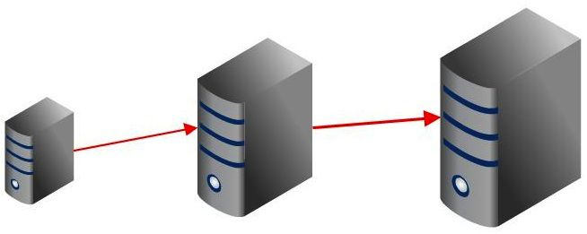
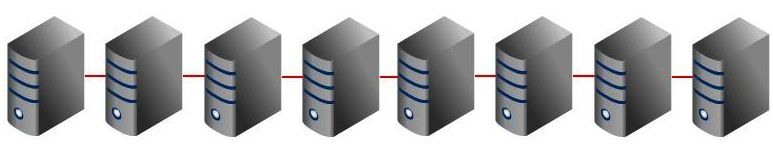
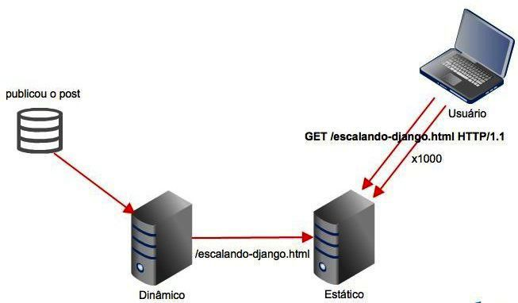

Escalabilidade em projetos Django
=================================

    Francisco Souza

    @franciscosouza

Presenter Notes
===============

Bom dia. Vamos falar sobre escalabilidade em projetos django.

---------------

what the f**rancisco?
=====================

.. image:: img/francisco-souza.jpg
   :class: speaker
   :align: right

.. image:: img/francisco-souza-muleque.jpg
   :class: child-speaker
   :align: right

.. class:: build half-screen

* djangobrasil.org
* Globo.com
* #cobrateam

Presenter Notes
===============

Mas antes eu vou me apresentar. Meu nome é Francisco Souza, eu sou moderador
e administrador da comunidade djangobrasil, desenvolvedor na Globo.com
e membro do #cobrateam.

---------------

.. class:: hidden

#cobrateam
==========

.. image:: img/cobrateam.jpg
   :class: full

Presenter Notes
===============

Falando um pouco sobre o #cobrateam, trata-se de um time de desenvolvedores
que se une para colaborar e ajudar a colaborar com open source. Quem aqui já tentou
colaborar com open source e não conseguiu? Nossa ideia é justamente ajudar pessoas
que querem colaborar ou mesmo iniciar um projeto open source. Também temos alguns
projetos open source, com diversos colaboradores.

---------------

.. image:: img/does-django-scale.png

---------------

.. image:: img/does-rails-scale.png

---------------

Mito da escalabilidade
======================

* Escalabilidade não é rodar rápido

.fx: build-code

.. sourcecode:: python

    def write_to_file(request):
        fp = open('file.txt', 'w')
        fp.write(request.path)
        fp.close()

        return HttpResponse("Ok")

Presenter Notes
===============

Escalabilidade não é perfomance. Alguém duvida que o código dessa view roda rápido?
Agora, o que acontece se eu receber 3000 requests simultâneos nessa view?

---------------

Mito da escalabilidade
======================

* Escalabilidade é independente da tecnologia (linguagem, framework ,etc.)

.fx: build-code

.. sourcecode:: go

    func WriteToFileHandler(w http.ResponseWriter, r *http.Request) {
        ioutil.WriteFile("file.txt", r.RawURL)
        w.Write("Ok")
    }

Presenter Notes
===============

Escalabilidade não está relacionado à tecnologia. O mesmo código do slide anterior transcrito
em uma linguagem estática. O código roda **MUITO** mais rápido, mas é tão escalável quanto o outro.

---------------

Escalabilidade
==============

**Aplicações** que escalam atendem a alguns requisitos básicos:

.. class:: build

#. são capazes de lidar com o crescimento de usuários
#. são capazes de lidar com o crescimento de dados
#. permanecem simples e fácil de manter à medida que evoluem (!)

Presenter Notes
===============

Já aplicações escaláveis têm algumas características que as qualificam como tal.
(veja os números ;D). Com isso podemos concluir que **QUALQUER** aplicação web pode
ecalar.

---------------

Escalabilidade vertical
=======================

.. class:: build

* Uma grande caixa (uma máquina)
* A caixa cresce à medida que a aplicação evolui
* Substituição de hardware

Presenter Notes
===============

Antes de vermos como escalar aplicações Django, precisamos diferenciar os tipos de
escalabilidade. A escalabilidade vertical é quando temos uma máquina, uma grande caixa
que cresce à medida que a aplicação cresce. Precisa de processamento? Compre um processador
melhor (ou adicione outro à máquina). Mais memória? Compre outro pente! Mais storage? Compre
outro disco. Sua máquina pifou? Senta e chora.

---------------

Escalabilidade horizontal
=========================

.. class:: build

* Várias máquinas com a mesma configuração (ou não)
* Redundância
* Fácil de escalar
* Adição de hardware

Presenter Notes
===============

Por outro lado temos a escalabilidade horizontal, que é baseada no princípio
de ter múltiplos hardwares respondendo. Você pode adicionar novos hardwares que
custem barato, ao invés de sempre comprar hardware mais caro e poderoso.

---------------

O que você prefere?
===================

.. class:: build

* 1 hardware de 100 milhões de reais
* 100 hardwares de 1 milhão de reais

Presenter Notes
===============

O que você prefere: um hardware de 100 milhões de reais ou cem hardwares de 1
milhão de reais?

---------------

.. image:: img/escalando.jpg
   :class: full

.. class:: subtitle

Escalando aplicações Django

.. class:: origin

http://www.flickr.com/photos/javifalces/3238781665

---------------

Caching
=======

Presenter Notes
===============

Vamos ver agora algumas técnicas de cacheamento em vários níveis.

---------------

Dinâmico x Estático
===================

Conteúdo que não é dinâmico não precisa ser servido dinamicamente.

.. class:: build

* Blogs
* Sites de notícias

Presenter Notes
===============

Uma forma de cache é gerar estaticamente o conteúdo. Certos sites não precisam
que o conteúdo seja consumido dinamicamente, como blogs e sites de notícias.

---------------

staticgenerator
===============

.fx: build-code

.. sourcecode:: python

    from staticgenerator import quick_publish

    quick_publish('/escalando-django.html')

Presenter Notes
===============

Uma excelente ferramenta para geração de conteúdo estático é o staticgenerator.

---------------

Dúvidas?
========

    Francisco Souza

    `@franciscosouza <http://twitter.com/franciscosouza>`_

    f@souza.cc

    `f.souza.cc <http://f.souza.cc>`_

.. image:: img/question-mark.png
   :class: question-mark
