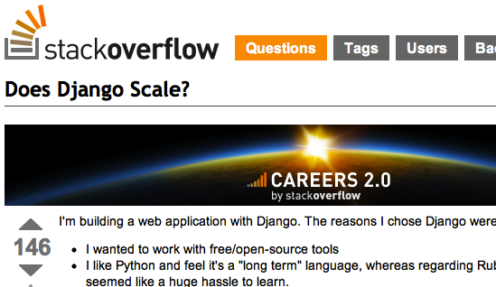
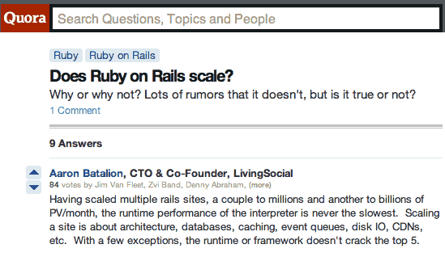
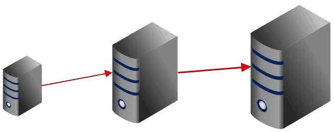
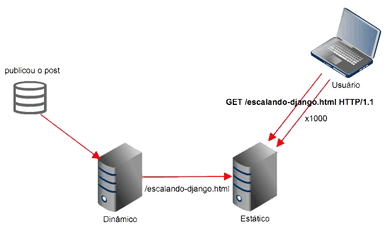
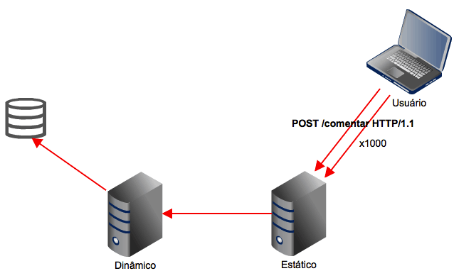

Escalabilidade em projetos Django
=================================

    Francisco Souza

    @franciscosouza

Presenter Notes
===============

Bom dia. Vamos falar sobre escalabilidade em projetos django.

---------------

what the f**rancisco?
=====================

.. image:: img/francisco-souza-muleque.jpg
   :class: child-speaker
   :align: right

.. class:: build half-screen

* djangobrasil.org
* Globo.com
* #cobrateam

Presenter Notes
===============

Mas antes eu vou me apresentar. Meu nome é Francisco Souza, eu sou moderador
e administrador da comunidade djangobrasil, desenvolvedor na Globo.com
e membro do #cobrateam.

---------------

.. class:: hidden

#cobrateam
==========

Presenter Notes
===============

Falando um pouco sobre o #cobrateam, trata-se de um time de desenvolvedores
que se une para colaborar e ajudar a colaborar com open source. Quem aqui já tentou
colaborar com open source e não conseguiu? Nossa ideia é justamente ajudar pessoas
que querem colaborar ou mesmo iniciar um projeto open source. Também temos alguns
projetos open source, com diversos colaboradores.

---------------

---------------

---------------

Mito da escalabilidade
======================

* Escalabilidade não é rodar rápido

.fx: build-code

.. sourcecode:: python

    def write_to_file(request):
        fp = open('file.txt', 'w')
        fp.write(request.path)
        fp.close()

        return HttpResponse("Ok")

Presenter Notes
===============

Escalabilidade não é perfomance. Alguém duvida que o código dessa view roda rápido?
Agora, o que acontece se eu receber 3000 requests simultâneos nessa view?

---------------

Mito da escalabilidade
======================

* Escalabilidade é independente da tecnologia (linguagem, framework ,etc.)

.fx: build-code

.. sourcecode:: go

    func WriteToFileHandler(w http.ResponseWriter, r *http.Request) {
        ioutil.WriteFile("file.txt", r.RawURL)
        w.Write("Ok")
    }

Presenter Notes
===============

Escalabilidade não está relacionado à tecnologia. O mesmo código do slide anterior transcrito
em uma linguagem estática. O código roda **MUITO** mais rápido, mas é tão escalável quanto o outro.

---------------

Escalabilidade
==============

**Aplicações** que escalam atendem a alguns requisitos básicos:

.. class:: build

#. são capazes de lidar com o crescimento de usuários
#. são capazes de lidar com o crescimento de dados
#. permanecem simples e fácil de manter à medida que evoluem (!)

Presenter Notes
===============

Já aplicações escaláveis têm algumas características que as qualificam como tal.
(veja os números ;D). Com isso podemos concluir que **QUALQUER** aplicação web pode
ecalar.

---------------

Escalabilidade vertical
=======================

.. class:: build

* Uma grande caixa (uma máquina)
* A caixa cresce à medida que a aplicação evolui
* Substituição de hardware

Presenter Notes
===============

Antes de vermos como escalar aplicações Django, precisamos diferenciar os tipos de
escalabilidade. A escalabilidade vertical é quando temos uma máquina, uma grande caixa
que cresce à medida que a aplicação cresce. Precisa de processamento? Compre um processador
melhor (ou adicione outro à máquina). Mais memória? Compre outro pente! Mais storage? Compre
outro disco. Sua máquina pifou? Senta e chora.

---------------

Escalabilidade horizontal
=========================

.. class:: build

* Várias máquinas com a mesma configuração (ou não)
* Redundância
* Fácil de escalar
* Adição de hardware

.. image:: img/escalabilidade-horizontal.png
   :class: align-center

Presenter Notes
===============

Por outro lado temos a escalabilidade horizontal, que é baseada no princípio
de ter múltiplos hardwares respondendo. Você pode adicionar novos hardwares que
custem barato, ao invés de sempre comprar hardware mais caro e poderoso.

---------------

O que você prefere?
===================

.. class:: build

* 1 hardware de 100 milhões de reais
* 100 hardwares de 1 milhão de reais

Presenter Notes
===============

O que você prefere: um hardware de 100 milhões de reais ou cem hardwares de 1
milhão de reais?

---------------

.. class:: subtitle

Escalando aplicações Django

.. class:: origin

http://www.flickr.com/photos/javifalces/3238781665

---------------

Caching
=======

Presenter Notes
===============

Vamos ver agora algumas técnicas de cacheamento em vários níveis.

---------------

Dinâmico x Estático
===================

Conteúdo que não é dinâmico não precisa ser servido dinamicamente.

.. class:: build

* Blogs
* Sites de notícias

Presenter Notes
===============

Uma forma de cache é gerar estaticamente o conteúdo. Certos sites não precisam
que o conteúdo seja consumido dinamicamente, como blogs e sites de notícias.

---------------

staticgenerator
===============

.fx: build-code

.. sourcecode:: python

    from staticgenerator import quick_publish

    quick_publish('/escalando-django.html')

Presenter Notes
===============

Uma excelente ferramenta para geração de conteúdo estático é o staticgenerator.
(Explicação rápida da imagem)

---------------

E se...
=======

Presenter Notes
===============

Mas e se o usuário fizer mil requisições do tipo POST? Não da pra botar uma página estática
pra responder por uma requisição POST. E se você recebe 1000 posts com 100Kb cada um a cada
segundo? O que vocês sugerem para solucionar o problema?

---------------

Deixe pra depois!
=================

.. class:: build

* `Celery <http://celeryproject.org/>`_
* `django-ztask <https://github.com/dmgctrl/django-ztask>`_
* `ActiveMQ <http://activemq.apache.org/>`_
* `ØMQ <http://www.zeromq.org/>`_

Presenter Notes
===============

Neste caso você pode usar o recurso de filas. Existem algumas ferramentas
relativamente famosas para enfileirar ações, para que elas sejam executadas
de forma assíncrona.

---------------

.. class:: subtitle

Camadas de cache no Django

.. class:: origin

http://www.flickr.com/photos/rvoegtli/5688343678/

---------------

De cima pra baixo...
====================

.. class:: build

- site caching
- view caching
- template fragment caching
- object caching

Presenter Notes
===============

Em ordem descendente, da forma mais abrangente para a mais abrangente temos
o caching por site, onde todo o site é cacheado, por view, onde o resultado de uma view
é cacheada (o objeto HttpResponse), o cache de fragmentos do template e o cache de objetos
individuais. O ideal para páginas muito dinâmicas é o object caching, mas tem um problema...

---------------

.fx: quote

    "There are only two hard things in Computer Science: cache invalidation and naming things"

    -- Phil Karlton

---------------

Backends de cache
=================

.. class:: build

* banco de dados
* sistema de arquivos
* locmem
* DummyCache
* memcached

Presenter Notes
===============

Hora de conhecer alguns dos backends de cache que já vêm no Django. É possível fazer cache no banco de dados (???),
no sistema de arquivos do sistema operacional. O locmem é para memória local do processo, há problemas em usá-lo, uma vez
que o gerenciamento é feito por processo. Se no mesmo computador você rodar 4 instâncias do gunicorn, por exemplo, cada um
terá seu próprio cache. Por último, há ou o memcached. Além disso, há aplicações de terceiros para caching.

---------------

memcached
=========

.. sourcecode:: python

    CACHES = {
        'default': {
            'BACKEND': 'django.core.cache.backends.memcached.PyLibMCCache',
            'LOCATION': [
                '10.0.2.1:11211',
                '10.0.2.4:11211',
                '10.0.2.7:11211',
            ]
        }
    }

Presenter Notes
===============

Só tenho uma coisa a dizer: use memcached :)

---------------

Cache além do Django
====================

.. class:: build

* Varnish/squid
* nginx

Presenter Notes
===============

Além disso, também há a possibilidade de instalar uma camada de cache àfrente da aplicação, usando
o varnish ou o squid, e ainda usar o nginx como frontend e proxy reverso.

---------------

Sessão
======

Presenter Notes
===============

Um outro ponto sobre escalabilidade são as sessões: onde persistir
os dados do usuário?

---------------

Backends de sessão
==================

.. class:: build

* banco de dados
* sistema de arquivos
* memcached

Presenter Notes
===============

O Django também conta com backends de sessão e usa, por padrão, o banco de dados.
Mas existem alternativas, da mesma forma que acontece com os backends de cache, também
é possível botar a sessão do Django no sistema de arquivos e no memcached.

---------------

Sessão (third party)
====================

.. class:: build

* redis
* MongoDB
* Tokyo Cabinet

Presenter Notes
===============

Além disso, há alguns backends de terceiros bastante conhecidos, principalmente o redis.
Há ainda a possibilidade de usar o MongoDB como backend de sessão (ou como banco de dados),
e ainda usar o Tokyo Cabinet, uma implementação do DBM.

---------------

O que usar?
===========

Presenter Notes
===============

Avalie o quanto você precisa da sessão. Se você precisar muito, use a memória.

---------------

Dúvidas?
========

    Francisco Souza

    `@franciscosouza <http://twitter.com/franciscosouza>`_

    f@souza.cc

    `f.souza.cc <http://f.souza.cc>`_

